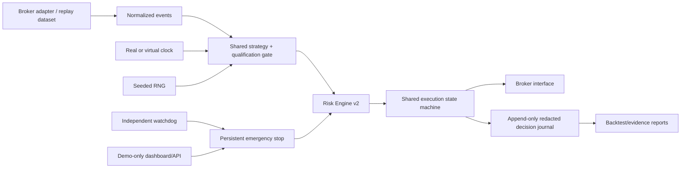
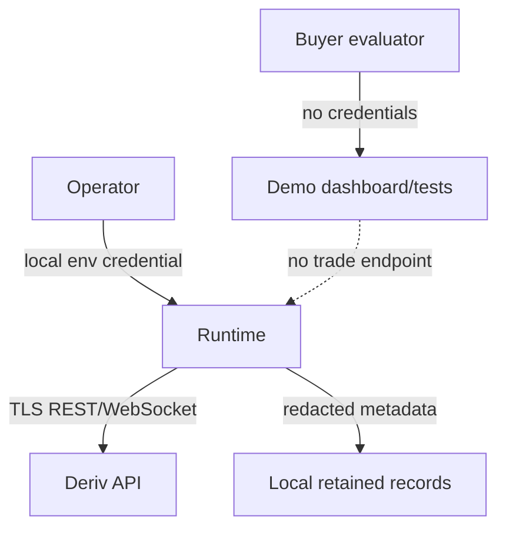

# Architecture

```mermaid
flowchart LR
  Feed[Broker adapter / replay dataset] --> Norm[Normalized events]
  Norm --> Strategy[Shared strategy + qualification gate]
  Strategy --> Risk[Risk Engine v2]
  Risk --> Exec[Shared execution state machine]
  Exec --> Broker[Broker interface]
  Exec --> Journal[Append-only redacted decision journal]
  Journal --> Reports[Backtest/evidence reports]
  Clock[Real or virtual clock] --> Strategy
  RNG[Seeded RNG] --> Strategy
  Watchdog[Independent watchdog] --> Stop[Persistent emergency stop]
  Stop --> Risk
  Dashboard[Demo-only dashboard/API] --> Stop
```

## Trust boundaries

```mermaid
flowchart TB
  User[Operator] -->|local env credential| Runtime
  Runtime -->|TLS REST/WebSocket| Provider[Deriv API]
  Runtime -->|redacted metadata| Disk[Local retained records]
  Buyer[Buyer evaluator] -->|no credentials| Demo[Demo dashboard/tests]
  Demo -. no trade endpoint .-> Runtime
```

The dashboard cannot enable live trading or accept broker credentials. Live compilation and runtime acknowledgement remain separate gates.
